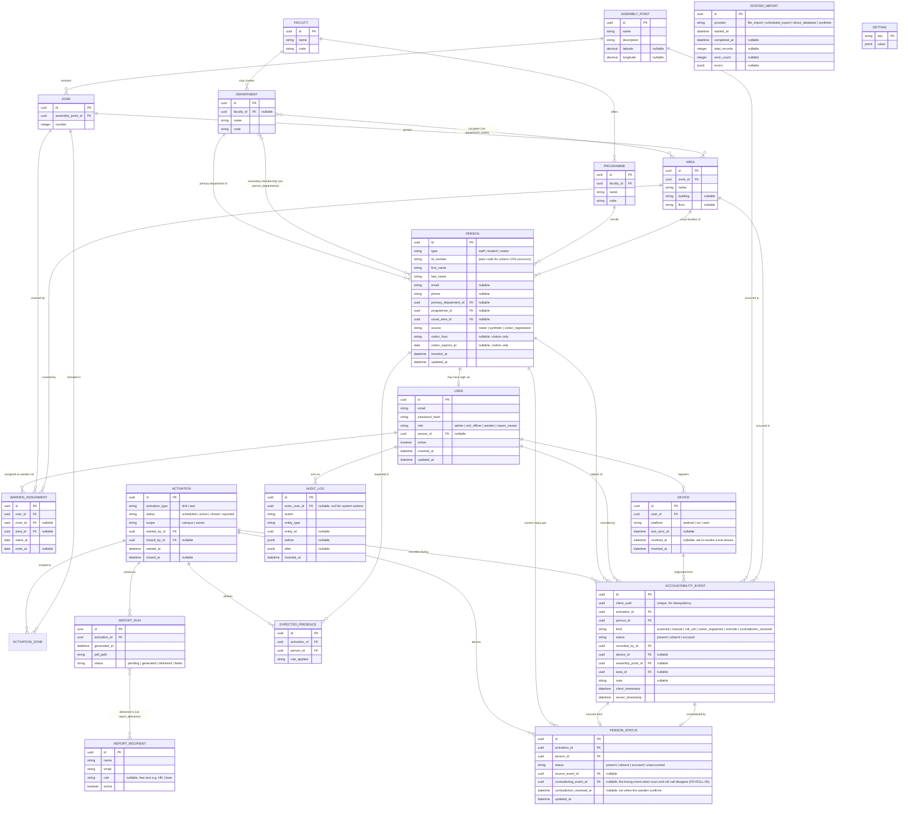

# Entity Relationship Diagram and Data Dictionary

**Document:** 06 of the project record
**Version:** 0.2 (Draft; revised 11 September 2026 per Document 13)
**Date:** 8 September 2026
**Prepared by:** Malik Christopher
**Status:** For review before the Ecto migrations (accompanying this document) are run against a real database.

This document is the visual and textual companion to the domain model in the Technical Foundation (03). The diagram is written in Mermaid, so it renders natively in GitHub, in VS Code with the Mermaid preview extension, and can be pasted directly into any dedicated ER tool (dbdiagram.io, drawSQL, Lucidchart) that accepts Mermaid or DBML import, if you want to move it there for visual editing.

---

## 1. Entity relationship diagram

---

## 2. Notes on relationships that are not obvious from the diagram

- **Department to Area is many-to-many**, via a join table (`department_areas`). This is what allows the Steel Building (one area) to house five departments, and it also allows a single department to have areas in more than one zone, both confirmed as real cases in the OSH Emergency Assembly Point Guide.
- **Person to Department** has two relationships: `primary_department_id` is a direct foreign key for the common case, and `person_departments` is a join table for anyone with a secondary departmental membership. Reporting queries use the join table as the source of truth; `primary_department_id` is a convenience denormalisation kept in sync on write.
- **Activation to Zone** is many-to-many through `activation_zones`, used only when an activation's scope is `zones` rather than `campus`. A campus-wide activation has no rows in this table and implicitly includes every zone.
- **PersonStatus is a derived table, not a source of truth.** It is recomputed (or upserted) every time a relevant `AccountabilityEvent` is written. The event table is the permanent record; `PersonStatus` exists purely so the dashboard can query current status without scanning the full event history each time. This mirrors the contradiction rule in FR-ROLL-05: the upsert logic prefers a `scanned` event over a `roll_call` event when both exist for the same person and activation.
- **ExpectedPresence is computed once per activation**, at start time, from the roster and the student accountability rule in effect (`Setting: student_accountability_rule`). It is what makes "unaccounted" a meaningful status: someone not expected is simply absent from the count, not flagged as missing.
- **ReportRun to ReportRecipient is many-to-many** via `report_deliveries` (not separately diagrammed above for space; it carries `delivered_at` and `delivery_status` per recipient, since one recipient might fail to receive an email that others received successfully).
- **AuditLog.actor_user_id is nullable** to allow system-initiated actions (the visitor purge job, an automated report retry) to still produce an audit trail, attributed to the system rather than a user.

---

## 3. Indexing and constraints (for the migrations)

- `accountability_events.client_uuid` — unique index. This is what makes sync retries idempotent (FR-SIGN-06).
- `person_statuses` — unique index on `(activation_id, person_id)`.
- `expected_presences` — unique index on `(activation_id, person_id)`.
- `people.id_number` — unique index where not null. Every visitor has one too
  (their generated `VIS-xxxxxxxx` pass code, Prompt 8), so the partial index
  exists for people with no `id_number` at all rather than for visitors
  specifically — none, currently, but the schema does not assume it stays
  that way.
- `warden_assignments` — a check constraint ensuring exactly one of `zone_id` or `area_id` is set, not both, not neither.
- `activations` — FR-ACT-05 (no two active activations in the same zone) is enforced in the Activations context inside a transaction. It cannot be a database constraint: zones live in the `activation_zones` join table and a campus-wide activation has no rows there, so no single partial unique index can express the rule.
- `person_statuses` — a partial index on `(activation_id, contradicting_event_id)` where the contradiction is unresolved, so the roll-call screen's "Flagged" group is a cheap query.
- Foreign keys throughout use `ON DELETE RESTRICT` for anything that would silently orphan accountability history, and `ON DELETE CASCADE` only for genuinely dependent join rows (`person_departments`, `department_areas`, `activation_zones`, `report_deliveries`).

---

## 4. What this document does not yet cover

Sequence diagrams for the sign-in, sync and report-generation flows, and the state diagram for the Activation lifecycle, are separate deliverables (documents 07 and 08 in the original sequence) and will use this data model as their basis.
