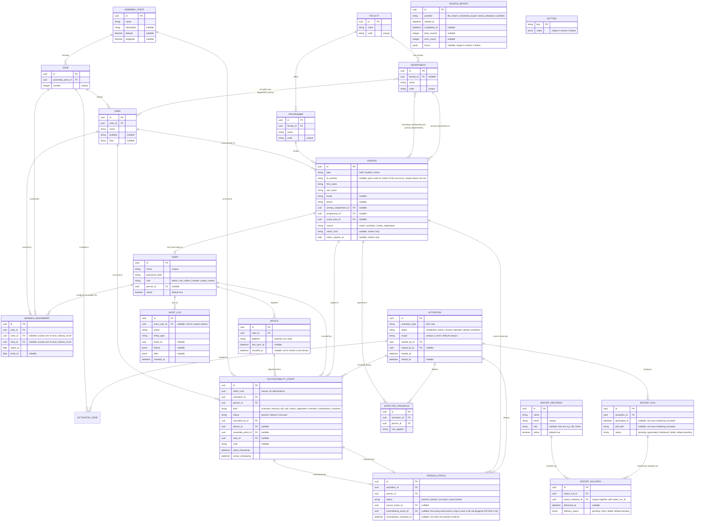

# Entity Relationship Diagram and Data Dictionary

**Document:** 06 of the project record
**Version:** 0.3 (Revised 14 September 2026 per Document 27's documentation pass, closing Document 25's findings 1.1–1.12)
**Date:** 8 September 2026 (original); revised 11 September 2026 per Document 13; revised again 14 September 2026
**Prepared by:** Malik Christopher
**Status:** Reflects the schema as actually migrated through Prompt 12 (Stage B complete). See the revision log, section 5, for what changed in this pass and why.

This document is the visual and textual companion to the domain model in the Technical Foundation (03). The diagram is written in Mermaid, so it renders natively in GitHub, in VS Code with the Mermaid preview extension, and can be pasted directly into any dedicated ER tool (dbdiagram.io, drawSQL, Lucidchart) that accepts Mermaid or DBML import, if you want to move it there for visual editing.

**Timestamps convention (stated once here, not repeated per entity below):** every entity in this document has both `inserted_at` and `updated_at` (`datetime`, both non-null, both set by Ecto's standard `timestamps/1` macro) with exactly one exception — `AUDIT_LOG`, which is insert-only (`updated_at: false` in its migration, since audit rows are immutable and never updated after being written; FR-AUD-02). Where an entity's field list below omits timestamps, this convention is what applies; it is not omitted because the fields don't exist.

---

## 1. Entity relationship diagram

Not shown in the diagram above, since it is a Postgres **view**, not a base table with its own rows or foreign keys, and so doesn't fit the entity-relationship notation: **`sync_safe_users`**, a view over `users` selecting `id, email, role, active, inserted_at, updated_at` — deliberately never `password_hash`. It exists as a second, independent, reviewable barrier against `password_hash` ever reaching a PowerSync client, alongside (not instead of) the sync stream's own explicit column list. It is **not** the actual PowerSync sync source — Postgres logical replication publications can only ever contain base tables, so a view has no WAL entries of its own and cannot be replicated from directly; `docker/powersync/sync-config.yaml`'s `sync_safe_users` stream queries `users` directly, repeating the view's own safe column list. See `docs/DECISIONS.md`, "PowerSync sync config (Prompt 10): `sync_safe_users` cannot be the sync source," for the full empirical trail, and the migration `20260913000001_create_sync_safe_users_view.exs` itself.

Also not shown: **`oban_jobs`** and **`oban_peers`**, created by `Oban.Migration.up()` (migration `20260912000002_add_oban_jobs_table.exs`) rather than by anything in this document's own domain modeling. They are Oban's own standard schema — the Postgres-backed background-job queue table and its leader-election table respectively — owned and managed entirely by the `oban` library, not part of Salvorion's domain model, and are not diagrammed here for the same reason `Repo` or `Ecto.Migration` itself isn't: they're infrastructure the application depends on, not a concept the application defines.

---

## 2. Notes on relationships that are not obvious from the diagram

- **Department to Area is many-to-many**, via a join table (`department_areas`). This is what allows the Steel Building (one area) to house five departments, and it also allows a single department to have areas in more than one zone, both confirmed as real cases in the OSH Emergency Assembly Point Guide.
- **Person to Department has two relationships, and they are not kept in sync with each other.** `primary_department_id` is a direct foreign key for the common case; `person_departments` is an independent join table for anyone with a secondary departmental membership. **Every dashboard and report figure that attributes a person to a department or faculty uses `primary_department_id` only** (`Accountability.participation_by_department/1`, `participation_by_faculty/1` — docs/DECISIONS.md, "Dashboard aggregates (Prompt 7): attribution and rate definitions"); `person_departments` rows never count toward any rate, specifically to avoid double-counting the same person under two departments' participation figures. `person_departments` is consulted only by `Roster.list_people/1`'s `:department_id` filter (a person with a matching secondary membership is included in that filtered list) — a different, narrower use than "the source of truth for attribution," which is what an earlier draft of this document claimed.
- **Activation to Zone** is many-to-many through `activation_zones`, used only when an activation's scope is `zones` rather than `campus`. A campus-wide activation has no rows in this table and implicitly includes every zone.
- **PersonStatus is a derived table, not a source of truth.** It is recomputed (or upserted) every time a relevant `AccountabilityEvent` is written. The event table is the permanent record; `PersonStatus` exists purely so the dashboard can query current status without scanning the full event history each time. The precedence the upsert logic actually applies (`Salvorion.Accountability`'s own moduledoc) is, highest first: **any `override` event** (an OSH Officer/Administrator status override, FR-ROLL-07) beats **any sign-in-kind event** (`scanned`, `manual`, or `visitor_registered` — not scanned alone) beats **any `roll_call` event** beats **`unaccounted`** (if expected) or no row at all. A sign-in and a contradicting `roll_call` mark for the same person is exactly the contradiction FR-ROLL-05 describes; `contradiction_resolved` events never affect `status` itself, only `contradiction_resolved_at` (see the next bullet).
- **A flagged contradiction is resolved by an event, not a direct column write.** A warden's "confirm" on a flagged row (Document 11, section 1.5) is recorded as an `AccountabilityEvent` of kind `contradiction_resolved`, ingested through the same `ingest_event/2` path as everything else — same idempotency, same audit row. `contradiction_resolved_at` is then a pure, rebuildable function of the event log (docs/DECISIONS.md, "Accountability core (Prompt 6): contradiction resolution is an event, so I4 holds fully"), never written to directly by any code path.
- **ExpectedPresence is computed once per activation**, at start time, from the roster and the student accountability rule in effect (`Setting: student_accountability_rule`). It is what makes "unaccounted" a meaningful status: someone not expected is simply absent from the count, not flagged as missing. See `docs/DECISIONS.md` for exactly what visitors never having an `ExpectedPresence` row means for them and any unaccounted list.
- **ReportRun to ReportRecipient is many-to-many via `report_deliveries`**, now diagrammed above as its own entity (it carries `delivered_at` and `delivery_status` per recipient, since one recipient might fail to receive an email that others received successfully).
- **AuditLog.actor_user_id is nullable** to allow system-initiated actions (the visitor purge job, an automated report retry) to still produce an audit trail, attributed to the system rather than a user.
- **`settings.value` is stored wrapped**, as `{"value": <the actual value>}`, because the column is a plain `jsonb` with no schema of its own and a bare scalar isn't valid top-level JSON in every context Ecto's `:map` type round-trips through. `Salvorion.Settings.get_setting/2` and `put_setting/3` are the only code that ever touches this column directly; every other caller sees the unwrapped value.
- **`roster_imports.errors` is stored as `{"rows": [{"row": <line number>, "reason": "<message>"}, ...]}`** — one entry per row that failed to import, `row` matching the CSV's own line number (line 1 is the header) so an admin reviewing a failed import can find the exact line. An import with zero errors stores `{"rows": []}`, not `null`.

---

## 3. Indexing and constraints (for the migrations)

- `accountability_events.client_uuid` — unique index. This is what makes sync retries idempotent (FR-SIGN-06).
- `accountability_events` — index on `(activation_id, person_id)` (status derivation scans a person's full event history for one activation) and on `kind` alone.
- `person_statuses` — unique index on `(activation_id, person_id)`.
- `person_statuses` — a partial index on `(activation_id, contradicting_event_id)` where the contradiction is unresolved, so the roll-call screen's "Flagged" group is a cheap query.
- `expected_presences` — unique index on `(activation_id, person_id)`.
- `people.id_number` — unique index where not null. Every visitor has one too (their generated `VIS-xxxxxxxx` pass code, Prompt 8), so the partial index exists for people with no `id_number` at all rather than for visitors specifically — none, currently, but the schema does not assume it stays that way.
- `people` — plain index on `type`, on `primary_department_id`, on `programme_id`; a partial index on `usual_area_id` where not null (added Prompt 7, after `EXPLAIN ANALYZE` against the 1,373-row dev roster showed a full sequential scan on that column with no index — every dashboard/roll-call query filters on it); a partial index on `visitor_expires_at` where `type = 'visitor'` (the daily purge job's own query).
- `faculties.code`, `departments.code`, `programmes.code` — unique indexes; roster imports resolve `department_code`/`programme_code` against these.
- `zones.number` — unique index.
- `users.email` — unique index.
- `report_recipients.email` — unique index.
- `report_deliveries` — unique index on `(report_run_id, report_recipient_id)` (the idempotency guard a retried delivery job relies on), plus a plain index on `report_recipient_id`.
- `devices.user_id`, `warden_assignments.user_id`/`zone_id`/`area_id`, `department_areas.area_id` — plain indexes for the obvious lookup direction.
- `warden_assignments` — a check constraint ensuring exactly one of `zone_id` or `area_id` is set, not both, not neither.
- `activations` — FR-ACT-05 (no two active activations in the same zone) is enforced in the Activations context inside a transaction, guarded by a Postgres advisory lock. It cannot be a database constraint: zones live in the `activation_zones` join table and a campus-wide activation has no rows there, so no single partial unique index can express the rule.
- **Foreign key deletion behaviour, corrected against the actual migrations** (an earlier draft of this section understated how much of the schema cascades):
  - `ON DELETE CASCADE`: `person_departments` (person, department), `department_areas` (department, area), `activation_zones` (activation, zone), `report_deliveries` (report_run, report_recipient), `warden_assignments` (user, zone, area — a deleted user or a deleted zone/area removes their assignment rows), `devices` (user), `person_statuses` (activation, person), `expected_presences` (activation, person).
  - `ON DELETE RESTRICT`: `accountability_events` (activation, person, recorded_by — the event log must never silently lose a row it's the permanent record for), `activations` (started_by, closed_by), `report_runs` (activation), `departments.faculty_id`, `programmes.faculty_id`, `zones.assembly_point_id`, `areas.zone_id`.
  - `ON DELETE NILIFY`: `accountability_events.device_id`/`assembly_point_id`/`area_id` (the event itself is never removed, only loses the reference), `people.primary_department_id`/`programme_id`/`usual_area_id`, `users.person_id`, `audit_logs.actor_user_id`.
  - The general rule this follows: CASCADE only for genuinely dependent join/detail rows that have no meaning without their parent; RESTRICT for anything that would silently orphan accountability or activation history; NILIFY for an optional attribution that can legitimately go missing without invalidating the row it's attached to.

---

## 4. What this document does not yet cover

OpenAPI generation (Document 03 §7, Stage B item 15) and the Dart client bridge into Flutter have not started; this document's field-for-field shape is the source those will be generated from once that work begins.

---

## 5. Revision log

- **14 September 2026 (this revision, per Document 27).** Closed Document 25's findings 1.1–1.12: the `AccountabilityEvent.kind` list restored to its actual six values (`override` and `contradiction_resolved` had been dropped from this document, though the schema and migration always had them); `sync_safe_users` and the Oban tables documented as non-diagrammed infrastructure; the department/faculty attribution note corrected to name `primary_department_id` as the only source rates use; the `PersonStatus` precedence note corrected from "scanned beats roll_call" to the real override-then-any-sign-in-then-roll_call order; the foreign-key deletion list corrected against the actual migrations (materially more CASCADE relationships than previously documented); the missing indexes added; `REPORT_DELIVERY` diagrammed as its own entity; nullable fields and defaults marked; the timestamps convention stated once instead of per entity; the `settings.value` and `roster_imports.errors` JSON shapes documented. Also corrected in passing, in the course of the same edit, because it directly contradicted the code and sat in a section already being rewritten: `PERSON.id_number` had been changed to say "nullable for visitors" in an edit outside this document's own revision history — every visitor is assigned a generated pass code at registration (`Roster.register_visitor/2`) and `id_number` is never left null for them; restored to describe the pass code, matching `docs/DECISIONS.md`'s "the pass code doubles as `id_number`" and the `people.id_number` indexing note both already correctly said.
- **11 September 2026**, per Document 13's consistency audit: `PERSON_STATUS` gained `contradicting_event_id`/`contradiction_resolved_at`; `DEVICE` gained `revoked_at`; the impossible "one active activation per zone" partial unique index claim was replaced with the actual application-layer enforcement description; a partial index on open contradictions documented.
- **8 September 2026**, original version, alongside the Technical Foundation (03).
