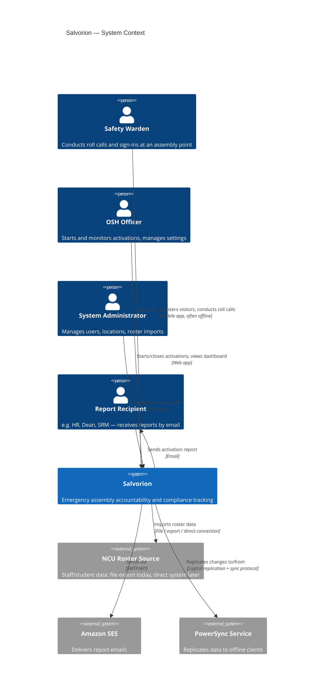
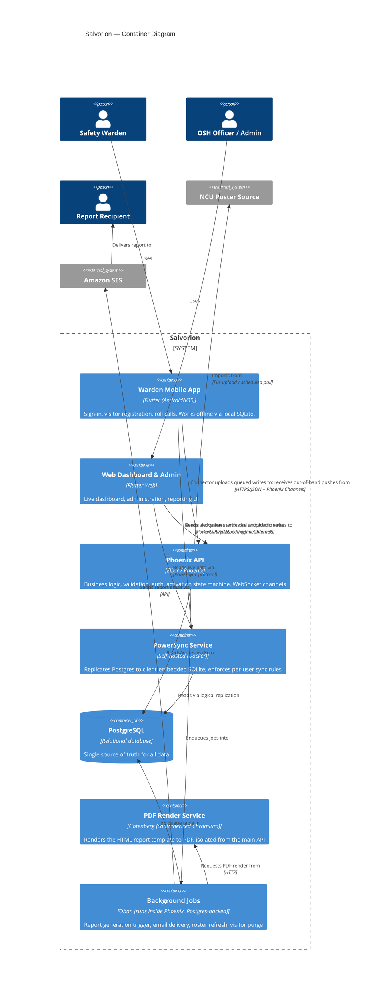
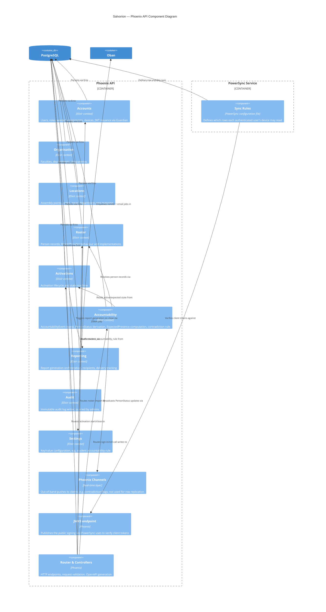
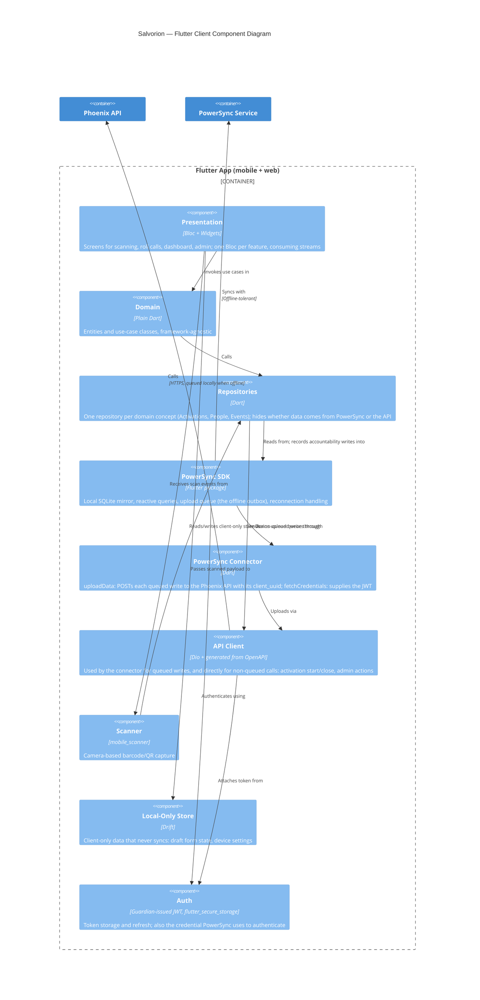

# Software Architecture Document: C4 Diagrams

**Document:** 07 of the project record
**Version:** 0.2 (Draft; revised 11 September 2026 per Document 13)
**Date:** 8 September 2026
**Prepared by:** Malik Christopher
**Status:** For review before Stage A development begins

This document uses the C4 model: Context, Container, Component, and (where useful) Code. Each level zooms in on the previous one. All diagrams are Mermaid, so they render in VS Code (with the Mermaid Preview extension), GitHub, and most documentation tooling.

---

## 1. Level 1: System Context

Who and what interacts with Salvorion, without any internal detail.

**Reading this diagram:** Salvorion is the one box in the middle. Everything else is either a person or a system Salvorion depends on but does not control. Notice that report recipients do not need a login; they receive email. Where OSH wants someone to see the dashboard as well, that person is given the separate read-only `report_viewer` role (FR-USR-01). Keeping the two apart keeps the list of people who need credentials small.

---

## 2. Level 2: Container Diagram

The deployable units inside Salvorion and how they talk to each other.

**Reading this diagram, and why it looks the way it does:**

- **Two client containers, one Flutter codebase.** The Warden Mobile App and the Web Dashboard are drawn separately because they serve different users with different UI, but they are built and shipped from the same Flutter project (see the Final Technology Stack, section 3, for why a separate SvelteKit dashboard was ruled out).
- **Reads and writes take different paths, and both clients read the same way.** This is the single most important structural decision in the whole system. *Reads* (the roster, current statuses, the dashboard feed) come from PowerSync's replicated local SQLite database on every client, mobile and web alike, so the dashboard and the warden's list are driven by the same replication stream. *Writes* (a sign-in, a roll-call mark) are recorded locally and placed in PowerSync's upload queue, which is the offline outbox; the client's PowerSync connector uploads each queued write to the Phoenix API, where it is validated, turned into an `AccountabilityEvent` row, and committed. The client-generated `client_uuid` travels with the write so a retry after a dropped connection is idempotent. Phoenix Channels are used only for out-of-band pushes that are not row replication, such as the contradiction flag returned to a warden.
- **The PDF renderer is its own container**, not code running inside Phoenix, specifically because of the memory and image-size cost discussed earlier. Oban calls it over HTTP the same way it would call any external service, so a spike in report-rendering memory never touches the process serving live API traffic.
- **Oban and the job queue live inside Postgres**, not in a separate Redis container. This is what "dropping Redis" (Technology Stack document, section 2) looks like at the container level: one fewer box to deploy, back up and monitor.

---

## 3. Level 3: Component Diagram — Phoenix API

Zooming into the one container with the most internal structure.

**Reading this diagram:** The sync rules are drawn inside the PowerSync service, not the Phoenix API, because they are a configuration file PowerSync reads, not Elixir code; do not look for them under `lib/`. Each remaining box under "Phoenix API" corresponds directly to a `lib/salvorion/<context>` folder, which is exactly the folder structure already generated in the Ecto schema package (document 06). This is deliberate: the architecture diagram and the actual code layout are the same shape, so there is no translation step between "what the diagram says" and "what file I open." The `Audit` context has no incoming write relationships drawn from other contexts individually only because every context calls it the same way (fire-and-forget on every mutation); that pattern will be enforced with a shared `Salvorion.Audit.record/1` helper rather than drawn as ten separate arrows.

---

## 4. Level 3: Component Diagram — Flutter Client

**Reading this diagram:** The key line is `repo_layer` sitting between the Bloc-driven presentation layer and what it talks to underneath: PowerSync for reads and for queued accountability writes (which the connector uploads to the API), and the API client directly for writes that should not be queued, such as starting an activation. No Bloc ever calls PowerSync or Dio directly; it always goes through a repository. That is what keeps the read/write split from Level 2 from leaking into every screen's code, and it is what makes the client testable, since a repository is trivial to fake in a Bloc test.

---

## 5. What comes next

- A sequence diagram for the sign-in flow (scan to dashboard update, both online and offline)
- A sequence diagram for the report generation flow (activation close to email delivered)
- A state diagram for the Activation lifecycle (scheduled → active → closed → reported, with the "cannot change type" and "cannot close except from active" rules from the Ecto changesets made visual)
- A deployment diagram showing where each container actually runs (single host to start, per the Technology Stack document)

These will follow once you confirm this document, or can be produced alongside the first Stage A prompts if you'd rather start typing now and treat the diagrams as documentation-in-parallel rather than a gate.
