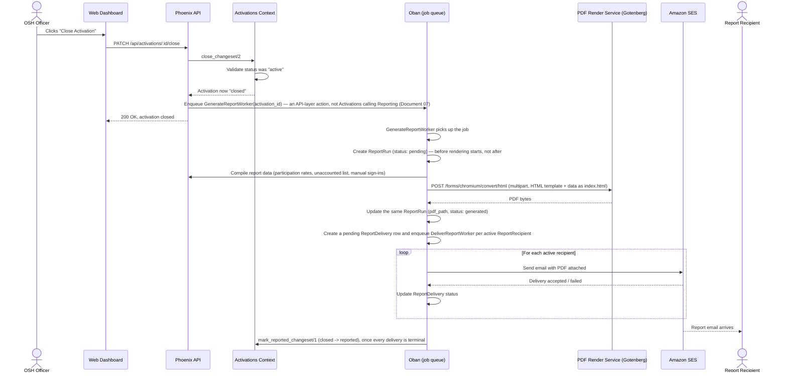
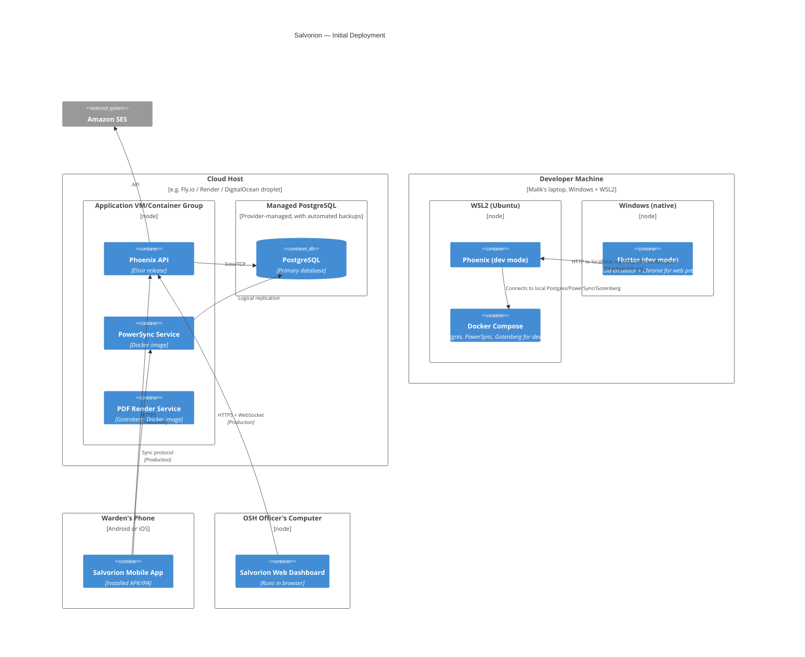

# Sequence, State and Deployment Diagrams

**Document:** 08 of the project record
**Version:** 0.2 (Draft; revised 11 September 2026 per Document 13)
**Date:** 8 September 2026
**Prepared by:** Malik Christopher
**Status:** For review. Completes the diagram set promised at the end of Document 07. Revised 14 September 2026 (Document 27, closing Document 25's findings 4.1, 4.7–4.12): every route corrected to its actual current path; §1 redrawn so the warden's confirmation fires from local state immediately, matching §2, rather than waiting on the API round-trip; a Phoenix Channels nudge added to §1; §3 redrawn to show contradiction resolution as an ingested event, not a direct column write; §4 redrawn so the `ReportRun` is created `pending` before rendering, and its Gotenberg call corrected to the real route; §5's "closed" note corrected to describe the actual 5-minute field-event window and unlimited-time review actions, instead of "no new events accepted at all."

All diagrams are Mermaid, rendering in VS Code (Mermaid Preview extension), GitHub, and any Mermaid-compatible viewer.

---

## 1. Sequence diagram: sign-in, online

The straightforward path, when the warden's device has connectivity at the moment of the scan.

```mermaid
sequenceDiagram
    actor W as Warden
    participant App as Mobile App (Flutter)
    participant API as Phoenix API
    participant DB as PostgreSQL
    participant PS as PowerSync
    participant Ch as Phoenix Channel
    participant Web as Web Dashboard

    W->>App: Scans ID card
    App->>App: mobile_scanner decodes barcode
    App->>App: Generate client_uuid, capture client_timestamp
    App->>App: Record event locally; PowerSync upload queue drains immediately (online)
    App-->>W: Confirmation beep + green check (optimistic, from local state — same as offline, Section 2)
    App->>API: Connector POSTs /api/activations/:id/events (client_uuid, person lookup key, activation_id, ...)
    API->>DB: Resolve person by id_number
    API->>DB: Insert AccountabilityEvent (kind: scanned, server_timestamp = now)
    API->>DB: Upsert PersonStatus (activation_id, person_id, status: present, source_event_id)
    API-->>App: 201 Created
    API->>Ch: Broadcast person_status_updated (a nudge, not the row itself — Prompt 12)
    Ch-->>Web: Push received (a joined admin/osh_officer/report_viewer/in-scope-warden socket)
    DB-->>PS: Logical replication picks up the change
    PS-->>Web: Reactive query updates dashboard with the actual data
    Web-->>Web: Participation rate and unaccounted list re-render
```

**What to notice:** the confirmation to the warden (the beep and green check) comes from **local state**, the instant the event is recorded on the device — never from the API round-trip, online or offline alike (this section previously showed it waiting on the API's `201`, which contradicted Section 2's own, correct description of the same principle; the two are now consistent). The Channel push and the PowerSync replication are two independent, parallel paths to the *dashboard's* update, not to the warden's own confirmation: the Channel push is a lightweight signal telling an already-connected client "something changed, go look," and PowerSync's reactive query is what actually supplies the new data once replication catches up — the Channel never carries the row itself (Document 07, section 2). The person standing at the scanner needs instant feedback regardless of how fast any of this happens.

---

## 2. Sequence diagram: sign-in, offline

The path that matters most for this system, since assembly points frequently have no connectivity.

```mermaid
sequenceDiagram
    actor W as Warden
    participant App as Mobile App (Flutter)
    participant PS as PowerSync SDK (local SQLite + upload queue)
    participant API as Phoenix API
    participant DB as PostgreSQL

    W->>App: Scans ID card
    App->>App: Generate client_uuid, capture client_timestamp
    App->>PS: Record event in local SQLite; PowerSync places it in the upload queue
    App-->>W: Confirmation beep + green check (optimistic, from local state)
    Note over App,PS: Device has no connectivity.<br/>Event sits in PowerSync's upload queue.
    W->>App: Continues scanning; more events queue locally
    Note over PS: Connectivity returns; PowerSync resumes uploading
    loop For each queued write, in order, via the connector's uploadData
        PS->>API: POST /api/activations/:id/events (same client_uuid as originally generated)
        API->>DB: Insert if client_uuid not already present (idempotent)
        API-->>PS: 201 Created (or 200 if already existed)
        PS->>PS: Remove write from upload queue
    end
    Note over PS: Server-derived PersonStatus replicates back down, replacing the optimistic local state
```

**What to notice, and why it matters:** the outbox is PowerSync's own upload queue, not a hand-built table (Document 04, section 4; Document 13, finding 1.1). The warden's confirmation happens the instant they scan, entirely from local state, before any network call is attempted. This is what "fully operable offline" (NFR-OFF-01) actually means in practice: the UI never waits on the network to tell the warden their scan worked. The `client_uuid` generated at the moment of the scan, not at the moment of syncing, is what makes the eventual sync idempotent (FR-SIGN-06): if the app crashes mid-sync and retries, or if a request succeeds but the response is lost, resubmitting the same `client_uuid` simply confirms the row already exists rather than duplicating it.

---

## 3. Sequence diagram: roll call contradiction

The one genuinely tricky data path in the system (FR-ROLL-05).

```mermaid
sequenceDiagram
    actor S as Someone
    actor Wa as Warden A (at scanner)
    actor Wb as Warden B (doing roll call)
    participant API as Phoenix API
    participant DB as PostgreSQL

    S->>Wa: Presents ID card at assembly point
    Wa->>API: Sign-in event (kind: scanned, status: present)
    API->>DB: Insert event; upsert PersonStatus = present (source: scanned)

    Note over Wb: Warden B has not yet seen this scan sync to their device
    Wb->>API: Roll-call event (kind: roll_call, status: absent)
    API->>DB: Insert event (always inserted; events are never rejected)
    API->>DB: Check existing PersonStatus for this person/activation
    DB-->>API: Existing status is "present", sourced from a sign-in-kind event
    API->>API: Apply contradiction rule: any sign-in (scanned/manual/visitor_registered) outranks roll_call
    API->>DB: PersonStatus remains "present"; set contradicting_event_id = the roll-call event
    API-->>Wb: Response includes the contradiction flag
    Note over Wb: PersonStatus (with contradicting_event_id) also replicates to Warden B via PowerSync

    Note over Wb: Later, Wb reviews the flagged row and confirms it
    Wb->>API: Confirm contradiction (POST .../resolve-contradiction)
    API->>API: Ingest a contradiction_resolved event through the same ingest_event/2 path as any other event — same idempotency, same audit row
    API->>DB: Insert contradiction_resolved event (status unaffected; the event itself never changes "present")
    API->>DB: Re-derive PersonStatus: contradiction_resolved_at = this event's server_timestamp
    API-->>Wb: Confirmation
    Note over Wb: contradiction_resolved_at (like everything else on PersonStatus) is a pure function of the event log — deleting and rebuilding the row reproduces it exactly
```

**What to notice:** the flag is a real column, `person_statuses.contradicting_event_id` (FR-ROLL-05; Document 06). Both the original sign-in and roll-call events are always stored, and so is the confirmation: it is **not** a direct write to `contradiction_resolved_at`, but its own `AccountabilityEvent` of kind `contradiction_resolved`, ingested exactly like a scan or a roll-call mark. Nothing is ever rejected or silently dropped, since the event log is the audit trail and every action a warden takes must be recoverable later — including confirming a contradiction. What changes on write is only the *derived* `PersonStatus`, and the losing event's kind is surfaced back to the warden as a flag rather than hidden, so a human resolves the ambiguity rather than the system quietly picking a side without anyone noticing. See `docs/DECISIONS.md`, "Accountability core (Prompt 6): contradiction resolution is an event, so I4 holds fully," for why this matters: because it's an event, a later `roll_call: absent` for the same person correctly reopens the contradiction, and rebuilding `PersonStatus` from scratch never loses the resolution.

---

## 4. Sequence diagram: report generation and delivery



**What to notice:** report generation is entirely decoupled from the request that closes the activation. The OSH Officer's click returns immediately once the activation is marked closed; everything from PDF rendering onward happens in the background via Oban, which is what keeps the heavier PDF-rendering work (see the Technology Stack document's note on Gotenberg's memory footprint) from ever blocking a user-facing request. The `ReportRun` row exists in a `pending` state from the moment the job starts, not only once a PDF has actually been produced — if `GenerateReportWorker` fails and Oban retries, the retry finds and continues the same `pending` run rather than creating a second, orphaned one (`Reporting.get_pending_report_run/1`). Worker names above are the real module names (`Salvorion.Reporting.Workers.GenerateReportWorker`/`DeliverReportWorker`); an earlier draft of this diagram called them `GenerateReportJob`/`DeliverReportJob`, names that were never actually used.

---

## 5. State diagram: Activation lifecycle

```mermaid
stateDiagram-v2
    [*] --> scheduled: Officer schedules an activation (schedule_changeset/2; optional)
    scheduled --> active: Officer starts it (activation_type locked from this point on)
    [*] --> active: Officer starts one directly, with no scheduling step
    active --> closed: Officer closes it (close_changeset/2; rejected unless status is active)
    closed --> reported: Report generated and all deliveries attempted (mark_reported_changeset/1)
    reported --> [*]

    note right of active
        activation_type (drill | real) cannot change.
        Only one activation may be active per zone
        at a time (FR-ACT-05).
    end note

    note right of closed
        Not a hard cutoff. A field event (scanned,
        manual, roll_call, visitor_registered) is
        still accepted if its client_timestamp is
        within 5 minutes of closed_at — an offline
        device syncing shortly after close. A review
        action (override, contradiction_resolved) is
        accepted at any time after close, with no
        window at all: reviewing the unaccounted list
        is meant to happen after the roll call ends.
        See docs/DECISIONS.md, "Accountability core
        (Prompt 6): late events after an activation
        closes."
    end note
```



**What to notice:** `scheduled` is genuinely optional in Release 1, most activations (especially real emergencies) will go straight from nothing to `active`. The state machine still models it because a drill is often planned in advance, and having the state available costs nothing now but would be a schema change later if omitted.

---

## 6. Deployment diagram

Where each container actually runs, for the initial release, per the constraint of keeping hosting costs modest.



**What to notice about the development leg specifically, since this is what you're setting up right now:** WSL2 forwards `localhost` ports to Windows automatically, so once your Phoenix dev server is running inside WSL2 on, say, port 4000, your natively-installed Flutter app on the Windows side can reach it at `http://localhost:4000` without any extra networking configuration. That's one of the more pleasant WSL2 defaults and it's why the split-environment setup (backend in WSL2, Flutter native) doesn't cause the friction it might sound like it would.

---

## 7. What remains after this document

Per the original SDLC sequence: business process models for the drill-activation and escalation workflows (BPMN-style, closer to an operational flowchart than a technical diagram), wireframes for the key screens, and the security design document (RBAC matrix, data classification). These can wait until Erlang and Elixir finish installing, or be tackled in the same documentation pass if you'd rather keep working on paper while your battery holds out.
