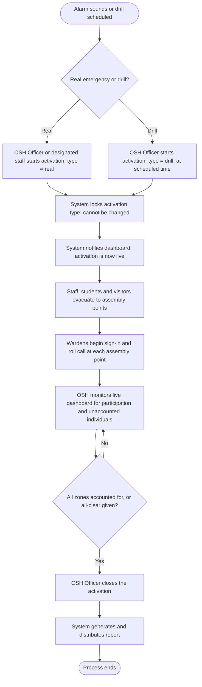
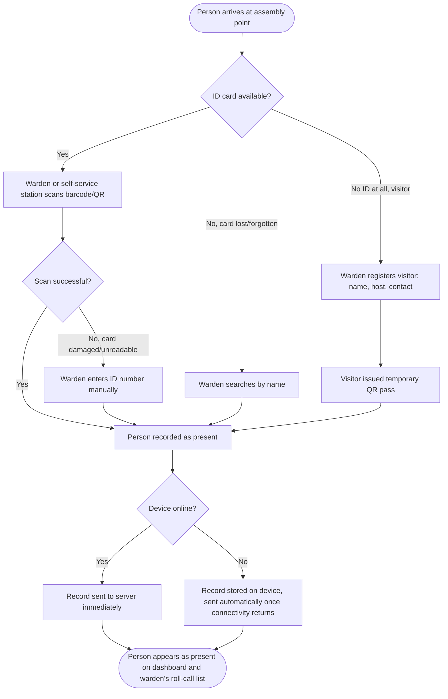
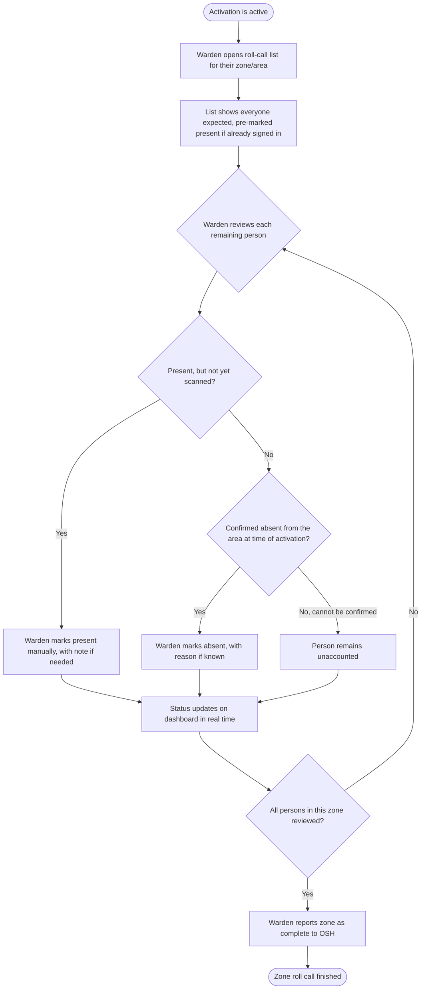
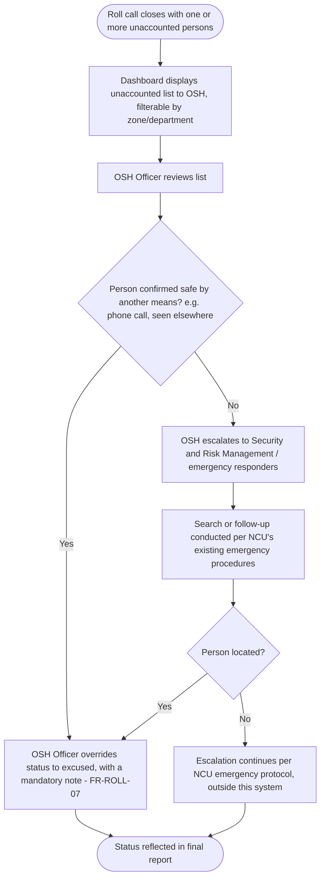

# Business Process Models

**Document:** 09 of the project record
**Version:** 0.2 (Draft; revised 11 September 2026 per Document 13)
**Date:** 8 September 2026
**Prepared by:** Malik Christopher
**Status:** For review. Revised 14 September 2026 (Document 27, closing Document 25's findings 6.2, 6.3, 6.7): the zero-recipients branch corrected to its actual outcome (marked "delivered," not "undelivered"; no dashboard banner exists yet), the all-deliveries-failed case noted, and a clarification added that a "self-service station" has no identity of its own — every event still needs an authenticated recording user.

These diagrams describe the operational processes Salvorion supports, at the level a non-technical reader (OSH, a warden, a report recipient) can follow. They sit above the sequence diagrams in Document 08, which show how the software implements each step; these show what happens and who is responsible for it, independent of implementation. Written in Mermaid flowchart syntax.

---

## 1. Drill or emergency activation process



**Responsible parties:** OSH Officer (start/close, monitor), Safety Wardens (sign-in, roll call), all campus occupants (evacuate and sign in). The distinction between real and drill is made once, at the very start, and is irreversible for the rest of the process, matching FR-ACT-02.

---

## 2. Sign-in process (at the assembly point)



**Responsible parties:** the person signing in, and the warden or self-service station operating the scanner. Every manual path (F, G, H) is logged with who performed it, satisfying FR-SIGN-04. Note on "self-service station": this diagram's box C allows either a warden or an unattended station to perform the scan, but the system has no separate identity model for a station — every `AccountabilityEvent`, regardless of what physically did the scanning, still needs an authenticated `recorded_by_id` (`Accountability.ingest_event/2` requires it; `recorded_by_id` is always the authenticated caller's own id, never client-suppliable — Document 26). A "self-service station" in Release 1 is, in practice, a device logged in as a real user (a warden's own login, or a shared kiosk account with its own credentials), not an anonymous or station-specific identity.

---

## 3. Departmental roll call process



**Responsible parties:** Safety Wardens. The "unaccounted" outcome (branch I) is what feeds the non-compliance list on the dashboard (FR-DASH-03) and is the trigger for any escalation, described next.

---

## 4. Escalation for unaccounted individuals

Release 1 keeps this manual, per the SRS (Appendix A: "escalation remains a manual OSH process in the first release"). This diagram documents the intended manual process so it is consistent across departments even without system automation.



**Responsible parties:** OSH Officer for the initial review and decision to escalate; Security and Risk Management or emergency responders for the physical search. The system's role ends at surfacing the list accurately and quickly (FR-DASH-03); it does not automate contact, search or dispatch in Release 1. This is the clearest candidate for Release 2 automation (e.g. automatic SMS to an unaccounted person's emergency contact) once OSH has operational experience with the manual version.

---

## 5. Automated report distribution process

```mermaid
flowchart TD
    A([Activation closed]) --> B[System compiles: participation rates, unaccounted list, manual sign-in log]
    B --> C[System renders report to PDF]
    C --> D[System retrieves active report recipient list]
    D --> E{Any active recipients configured?}
    E -->|No| F[Report run marked "delivered" (vacuously — zero deliveries, all zero of them terminal); no dashboard banner exists yet]
    E -->|Yes| G[System emails PDF to each active recipient]
    G --> H{Delivery successful for this recipient?}
    H -->|Yes| I[Delivery marked sent]
    H -->|No| J[Delivery marked failed; retried automatically per standard retry policy]
    I --> K{All recipients processed?}
    J --> K
    K -->|No| G
    K -->|Yes| L[Report run marked "delivered"; activation marked reported]
    F --> L2[Activation marked as reported]
    L --> M([Process ends; report remains available in activation history])
    L2 --> M
```

**Responsible parties:** the system performs this process without human involvement (FR-REP-01, FR-REP-03), except for the exception path (E → F), where OSH is expected to configure at least one recipient before relying on the process. OSH remains responsible for managing the recipient list itself (FR-REP-04). **Corrected from an earlier draft of this diagram (Document 25, finding 6.2):** branch F's actual outcome is a `ReportRun` marked `"delivered"` — the same status a fully successful run gets — not "undelivered," and there is currently no dashboard banner telling OSH that no recipients were configured; only the per-run audit action `"report.no_recipients_configured"` records that this happened, visible only to an Administrator reading the audit log. A dashboard banner remains a reasonable idea, but it is **aspirational**, not built, as of Stage B's completion — this diagram should not be read as describing a feature that exists. **A related case, not previously diagrammed (finding 6.3):** if every recipient's delivery *fails* (branch K → L with every delivery `failed`, not `sent`), the run still ends `"delivered"` at the activation level once every delivery reaches a terminal state, whether that state is `sent` or `failed` — "delivered" here means "no delivery is still pending," not "every delivery succeeded." Only the per-delivery `ReportDelivery.delivery_status` rows show which recipients, if any, actually received the email; nothing on the `Activation` or `ReportRun` record itself distinguishes "every recipient got it" from "generation succeeded but every send failed."

---

## 6. Notes on how these differ from the sequence diagrams (Document 08)

- These process models describe **what happens and who is accountable**, in language OSH and wardens can validate directly against real drill procedure.
- The sequence diagrams describe **how the software implements each step**, including which service calls which, and are the ones a developer works from.
- Where the two overlap (sign-in, report generation), they should never contradict each other. If a future change to the software changes a business rule (for example, if escalation becomes automated in Release 2), both documents need updating together.
